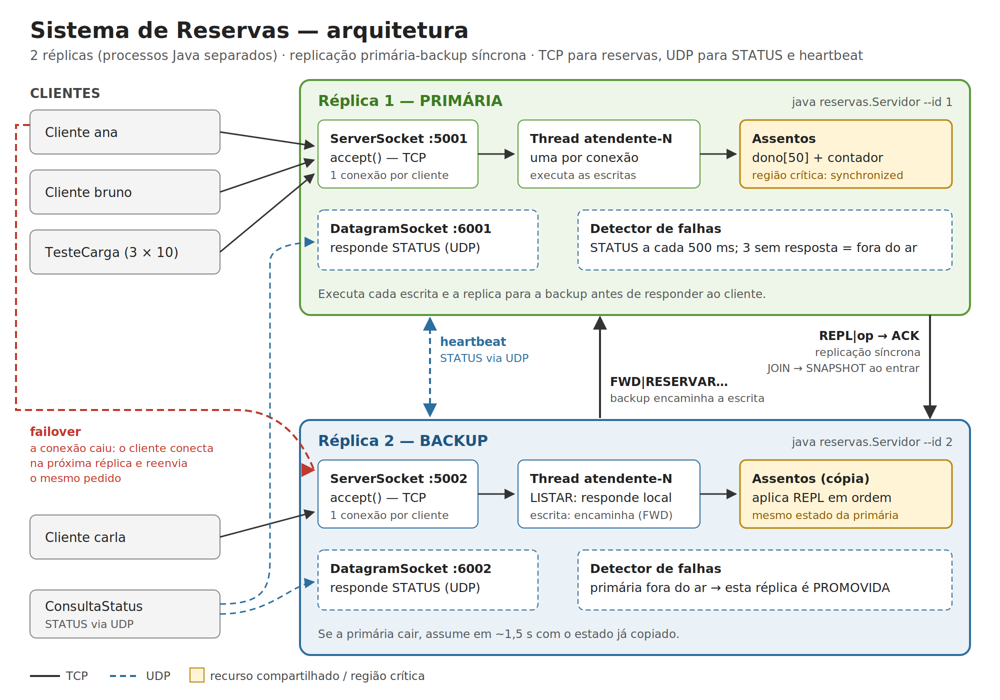

# Sistema de Reservas — Concorrência, Sincronização e Distribuição

Atividade prática de **Programação Concorrente e Distribuída** (IFSC Câmpus Gaspar).

Servidor de reservas de assentos em Java, com:

- **TCP**: `ServerSocket` + **uma thread por cliente**;
- **região crítica** com modo sem/com `synchronized`, para produzir e corrigir a condição de corrida;
- **2 réplicas** em processos separados, com replicação **primária-backup síncrona** e **failover** automático;
- **UDP**: consulta `STATUS` e heartbeat entre as réplicas;
- cliente que reconecta sozinho em outra réplica, sem duplicar reservas.

## Como rodar

Tudo roda pelo **VS Code**, pelo menu **Terminal → Executar Tarefa...**, que mostra 6 tarefas numeradas na ordem da apresentação. Precisa de um JDK 11 ou mais novo instalado (`javac` e `java`). O passo a passo completo está em **[`docs/ROTEIRO-DEMONSTRACAO.md`](docs/ROTEIRO-DEMONSTRACAO.md)**.

Resumo: rode a tarefa 1 uma vez e deixe os terminais abertos; depois rode as tarefas 2, 3 e 4, uma de cada vez; no TESTE 6, rode a 5 (derruba a réplica 1) e depois a 6 (religa).

## Documentos

| Arquivo | Conteúdo |
|---|---|
| [`docs/ROTEIRO-DEMONSTRACAO.md`](docs/ROTEIRO-DEMONSTRACAO.md) | Passo a passo de execução (TESTES 1 a 6) |
| [`docs/RELATORIO.md`](docs/RELATORIO.md) | Relatório técnico: resultados, respostas às 9 perguntas, limitações |
| [`docs/PROTOCOLO.md`](docs/PROTOCOLO.md) | Protocolo de aplicação em tabelas |
| [`docs/arquitetura.png`](docs/arquitetura.png) | Diagrama da arquitetura |
| `logs/` | Logs gerados ao rodar: `replica-1.log`, `replica-2.log` e um arquivo por experimento (`teste-sem-sync-...log`, `teste-com-sync-...log`) |



## Estrutura

```
sistema-reservas/
├── src/main/java/reservas/
│   ├── Servidor.java          réplica: TCP, UDP, replicação, detector de falhas, failover
│   ├── Atendente.java         thread por conexão; interpreta o protocolo
│   ├── Assentos.java          recurso compartilhado e REGIÃO CRÍTICA
│   ├── Par.java               o que uma réplica sabe da outra + conexão de replicação
│   ├── ClienteReservas.java   lado cliente, com reconexão em outra réplica (failover)
│   ├── Cliente.java           cliente interativo (listar, reservar, cancelar, sair)
│   ├── TesteCarga.java        experimento: 3 clientes x 10 reservas simultâneas
│   ├── ConsultaStatus.java    STATUS via UDP e comparação TCP x UDP
│   └── Conexao.java, Endereco.java, Log.java, Args.java
├── .vscode/                   tarefas numeradas (Terminal → Executar Tarefa...)
├── docs/                      roteiro, relatório, protocolo e diagrama
├── logs/                      logs gerados na execução
└── pom.xml                    faz o editor do VS Code reconhecer o projeto Java
```

## Publicar no Git

```
git init
git add .
git commit -m "Sistema de reservas: concorrencia, sincronizacao e replicacao"
git branch -M main
git remote add origin https://github.com/jarbasmferreirajr/sistema-reservas.git
git push -u origin main
```

## Checklist do enunciado

| Item | Onde |
|---|---|
| Servidor TCP com ≥3 clientes simultâneos | Tarefa 1 (TESTE 1); `Servidor.loopAceitar()` cria uma thread por conexão |
| 30 requisições concorrentes (3×10) | Tarefas 2 e 3 (`TesteCarga`, largada comum com `CountDownLatch`) |
| Condição de corrida registrada em log sem sincronização | Tarefa 2 → `logs/replica-1.log` (linhas `RC` e `!! CORRIDA`) |
| Sincronização e mesmo teste repetido com sucesso | Tarefa 3 → 30/30 |
| ≥2 réplicas com estado replicado, tolerando queda | Primária-backup síncrona; tarefas 5 e 6 (TESTE 6) |
| UDP implementado | `STATUS` e heartbeat; tarefa 4 (TESTE 5) |
| Desconexão de cliente tratada | `Atendente.run()`: o servidor registra e continua atendendo |
| Protocolo documentado | `docs/PROTOCOLO.md` |
| Diagrama da arquitetura | `docs/arquitetura.png` |
| Logs dos dois experimentos | `logs/teste-sem-sync-...log` e `logs/teste-com-sync-...log` |
| Relatório técnico | `docs/RELATORIO.md` |
